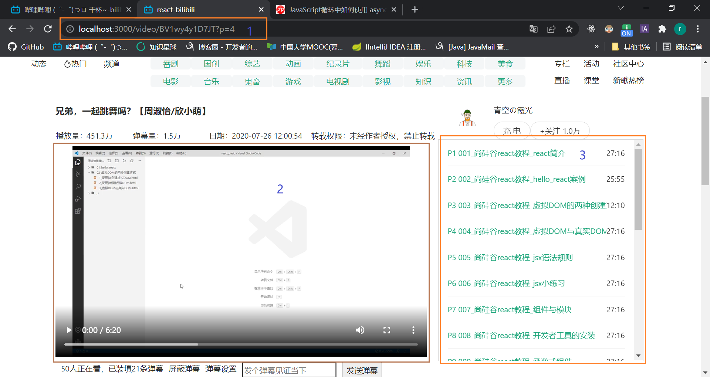

### 2022.3.3
- antd栅格系统的不熟悉
### 2020.3.10
- 关于循环中如何使用 async/await：https://www.php.cn/js-tutorial-465033.html
### 2020.3.12
- 关于video详情页的设计问题

  最初，没有考虑Video组件刚挂载的问题，只是在2、3处进行处理（最初只考虑了2只能被3影响，实际Video组件挂载的时候也能影响2）
  - /video对应Video父组件的路由 
  - /video/BV1wy4y1D7JT对应PlayerBlock子组件的路由 
  - 实际上，2被2个地方影响。
    - 首先是Video组件的挂载，同时也会把PlayerBlock子组件给渲染出来，
    这时你并没有点击3，2的this.props.location为undefined，那怎么根据已挂载的Video路由组件渲染合适的PlayerBlock组件呢？
    没错，通过父子组件的传递参数来解决，Video可以通过this.props.location.search来获得url的参数，然后给PlayerBlock子组件直接传参，
    PlayerBlock组件接收到后，获取url的视频数据进行渲染。
    - 然后，3也可以影响2，这个时候，就通过路由组件的传参来解决了。2获得3传来的参数，重新渲染2
    ```react
    // VideoList组件（3）
    <Link to={`/video/BV1wy4y1D7JT?p=${item.id}`}>
    // Video路由组件（2）
    <Switch>
        <Route path={`/video/BV1wy4y1D7JT`} component={PlayerBlock}/>
    </Switch>
    ```
  - 总结：2处的渲染受到2个地方影响（1、3），1的话，是因为父组件渲染子组件时需要；3的话，是Video组件挂载完之后，3处通过给2路由组件传参来影响
### 2022.3.14
  - react-router-dom的<Switch>相当于一个开关，这个开关决定了“其中所有路由”的挂载与否
### 2022.3.15
  - 当时的情况如下（出现bug的情景复现）：有一个路由组件，其中包含播放器组件、播放列表组件等，我根据路由组件的this.props.location获取相应的参数，然后根据参数获取后台数据（后台数据包含id），
    然后又想把获取的后台数据的id传递给播放列表子组件（通过this.props传递），让子组件去拿视频列表。
    这其实已经出现问题，因为播放列表子组件的首次渲染肯定是因为父组件的渲染，但后台数据的id是父组件异步获取到的，
    而这时（指首次渲染），父组件传递给子组件的id肯定为undefined，会导致子组件出现bug

  - 在父组件中获取后台数据后，切勿在该父组件的子组件中再次向后台要数据。
    
    因为可能出现这种情况，父组件会根据后台数据渲染其中的子组件，你还想在子组件中获取一些后台数据， 这就会引起”父组件渲染子组件“与”子组件自行根据获取的数据进行的渲染“之间的冲突
    比如：子组件想要父组件后台数据的id，然后根据父组件传来的id再次向后台要数据。
    但是子组件首先肯定是因为父组件的渲染而进行渲染，这时传递的id参数肯定为undefined，子组件肯定拿不到想要的数据
    
    总结：父组件在获取数据时，直接把子组件需要的数据给获取到，直接使用this.props给子组件传递即可。或者父组件不要获取数据，而是让它的多个子组件各自获取自己的数据，从而防止渲染冲突
### 2022.3.20
  - create-react-app配置代理问题
  - B站资料：https://www.bilibili.com/video/BV1wy4y1D7JT?p=65
  - 但根据上面资料，还是无法运行
  - 查找StackOverFlow资料:https://stackoverflow.com/questions/70374005/invalid-options-object-dev-server-has-been-initialized-using-an-options-object，使用http-proxy-middleware，成功
  - 后续查找到github资料:https://github.com/facebook/create-react-app/issues/5103，官方说支持字符串型的package.json文件中的proxy，但本机却不行，报错，官方提供的第二种方法（也就是sof（StackOverFlow）提供的方法），可以
  - 至此，前后端数据first交互完成
### 2022.3.23
  - 需求：根据cookie中是否有video_id的value来判断，若video_id为undefined，则导航栏的登录状态展现为“登录”；否则，展现为“用户头像”
  - 查找资料：https://juejin.cn/post/6844903497658269703
  - 学习到：jsx的语法，在回调函数里面写if-else代码，并在回调函数后面带上()，直接调用回调函数
### 2022.3.23
  - 需求：使用React Hook来适配antd的样例代码
  - 资料：https://zh-hans.reactjs.org/docs/hooks-state.html
### 2022.3.23
  - 需求：UserAvatar函数组件中：密码登录界面，点击注册，跳转到短信登录界面，并弹出提示
  - 资料：https://reactjs.org/docs/refs-and-the-dom.html#callback-refs
  - 未实现，需要学习ref，按照官网资料的没成功
### 2022.3.25
  - bug场景：根据user_id异步获得data1（data1其实就是把user_id进行了封装，你没看错，就是user_id）（axios），然后把data1通过this.props传递给子组件1
  - 解决方式：不使用在axios的then中data1，直接把user_id传递给子组件1
  - 总结：切记！！！！！：不要给子组件传递异步生成的变量（即axios.xxx.then中的任何变量}）
  - eg：我在axios的then中产生var1变量/数据，然后我把这个变量/数据用this.setState存放在this.state中，这时候不要this.state.var1传递给子组件了
  - 
  - react代码写到现在，总结了一套方法：通过路由组件获得id，该id传给父组件，不要以任何方式在父组件中获取数据（除非你确保在父组件获取的数据不会传递给子组件，而是父组件自己用！！），
    然后把id通过this.props从父组件传递给子组件，让子组件根据id进行操作，操作情况和父组件一样（根据id获取的异步数据不能传递给子子组件；否则，传递id给子子组件，让其自行操作）
  - 有一点可以明确：父组件获取的异步数据不能通过this.props传递给子组件！！！
### 2022.3.29
  - 需求：react中获取用户上传视频文件的某一帧的图片
  - 资料：https://juejin.cn/post/6844904115445694477
### 2022.4.1
  - 需求：上传一个视频文件、一个标题字符串、一个介绍字符串到后台
  - 问题：（问题开始出现在react-bilibili/src/components/TopMenu/Member/Upload_c/VideoContribute/index.js文件）react使用antd的Form组件，发现并没有上传的action（而antd的Upload组件就有action）
  - 解决方法：Form组件其实并不负责与后台交互（写到这，我突然想起了react的初衷 => 前端界面框架，并不负责与后台交互）。Upload是个例外。Form表单组件负责”收集数据“，使用onFinish回调。
然后你把其中需要的数据进行校验后给FormData（最好使用FormData，不使用的话请求报文默认是三大格式的json格式；且就算自己设置axios请求的headers为multipart/form-data，也会出现没有post正文边界的问题），使用axios把FormData传给后端即可
#### 2022-4-2
  - Apipost的使用：注意Mock环境与默认环境的不同。Mock环境是专门mock数据的，而默认环境是测试后端接口的
  - 使某一行的count+1：

    ```sql
    update video set video_play_count=video_play_count+1
    where video_id='41796c186b50'
    ```

  - watch_action不要设置主键，因为（同一个人、同一个视频）不能确定唯一的观看记录，可以有多条记录
  - 点赞与投币
    - 点赞功能：在挂载时获得点赞数的同时，也获得点赞记录的状态，根据该状态渲染是否点赞。后续进行点赞或者取消点赞，把该状态反转后，给后台
    - 投币功能：在挂载时获得投币数的同时，也获得投币记录的状态，根据该状态渲染是否投币。若为已投币，则提示“已经投过币”。后续进行投币，该状态不用给后台

  - 在/video/xxxx路由组件中，传递新的收藏夹数据时，需要传递两个字符串、一个对象数组

    ```json
    {
        "userId": "586422828",
        "videoId": "BV1GX4y1P7c3",
        "newStarDirs": [
            {"star_dir_id": "1", "exist": false},
            {"star_dir_id": "2", "exist": true},
            {"star_dir_id": "3", "exist": true},
            {"star_dir_id": "4", "exist": false},
            {"star_dir_id": "5", "exist": false},
            {"star_dir_id": "6", "exist": false},
            {"star_dir_id": "7", "exist": false},
            {"star_dir_id": "8", "exist": false}
        ]
    }
    ```

    经过查找资料以及实践，得出：

    前端：

    ```react
    axios.post(_url,{
                userId:cookie.load("user_id"),
                videoId:videoId,
                newStarDirs:newStarDirs
            }).then(_d=>{
                    console.log(_d.data)
                })
    ```

    后端：

  ```
  public String newUserStarDirs(@RequestBody NewUserStarDir newUserStarDir)
  ```

  ```java
  package com.prvyx.pojo;
  
  import java.io.Serializable;
  import java.util.List;
  
  /**
   * @program: java-bilibili
   * @description:
   * @author: Prvyx
   * @created: 2022/04/02 20:50
   */
  
  public class NewUserStarDir implements Serializable {
      private String userId;
      private String videoId;
      private List<NewStarDir> newStarDirs;
  
      public NewUserStarDir() {
      }
  
      public NewUserStarDir(String userId, String videoId, List<NewStarDir> newStarDirs) {
          this.userId = userId;
          this.videoId = videoId;
          this.newStarDirs = newStarDirs;
      }
  
      public String getUserId() {
          return userId;
      }
  
      public void setUserId(String userId) {
          this.userId = userId;
      }
  
      public String getVideoId() {
          return videoId;
      }
  
      public void setVideoId(String videoId) {
          this.videoId = videoId;
      }
  
      public List<NewStarDir> getNewStarDirs() {
          return newStarDirs;
      }
  
      public void setNewStarDirs(List<NewStarDir> newStarDirs) {
          this.newStarDirs = newStarDirs;
      }
  
      @Override
      public String toString() {
          return "NewUserStarDir{" +
                  "userId='" + userId + '\'' +
                  ", videoId='" + videoId + '\'' +
                  ", newStarDirs=" + newStarDirs +
                  '}';
      }
  }
  
  ```

  ```java
  package com.prvyx.pojo;
  
  import java.io.Serializable;
  
  /**
   * @program: java-bilibili
   * @description:
   * @author: Prvyx
   * @created: 2022/04/02 22:06
   */
  
  public class NewStarDir implements Serializable {
      private String star_dir_id;
      private Boolean exist;
  
      public NewStarDir() {
      }
  
      public NewStarDir(String star_dir_id, Boolean exist) {
          this.star_dir_id = star_dir_id;
          this.exist = exist;
      }
  
      public String getStar_dir_id() {
          return star_dir_id;
      }
  
      public void setStar_dir_id(String star_dir_id) {
          this.star_dir_id = star_dir_id;
      }
  
      public Boolean getExist() {
          return exist;
      }
  
      public void setExist(Boolean exist) {
          this.exist = exist;
      }
  
      @Override
      public String toString() {
          return "NewStarDir{" +
                  "star_dir_id='" + star_dir_id + '\'' +
                  ", exist=" + exist +
                  '}';
      }
  }
  
  ```

#### 2022.4.3
  - react重新渲染的条件：检测setState()参数发生改变。若参数为数组，则需要改变原来的数组引用值，不然react不会检测到改变

  eg：

  ```
  0: {star_dir_id: '1', star_dir_title: '默认收藏夹', exist: false}
  1: {star_dir_id: '2', star_dir_title: '数据库设计', exist: false}
  2: {star_dir_id: '3', star_dir_title: 'Git', exist: false}
  3: {star_dir_id: '4', star_dir_title: 'Mock的理解以及运作流程', exist: true}
  4: {star_dir_id: '5', star_dir_title: 'Python', exist: false}
  5: {star_dir_id: '6', star_dir_title: '前后端分离', exist: false}
  6: {star_dir_id: '7', star_dir_title: 'SSL', exist: false}
  7: {star_dir_id: '8', star_dir_title: '并非程序员，而是创造者', exist: false}
  length: 8
  [[Prototype]]: Array(0)
  ```

  前端正确代码：

  ```react
  <List
                          itemLayout="horizontal"
                          dataSource={this.state.starDirs||[]}
                          renderItem={item => (
                              <List.Item>
                                  <List.Item.Meta
                                      title={<Checkbox defaultChecked={item.exist} onChange={(e)=>{
                                          const changedStarDirs=this.state.starDirs.map((starDirObj)=>{
                                              if(starDirObj.star_dir_id===item.star_dir_id)
                                                  return {...starDirObj,exist:e.target.checked}
                                              else return {...starDirObj}
                                          })
                                          this.setState({starDirs:changedStarDirs})
                                      }
                                      } >{item.star_dir_title}</Checkbox>}
                                  />
                              </List.Item>
                          )}
                      />
  ```

  不要在onChange回调中直接修改item.exist=e.target.checked，这样react检测不要this.state.starDirs的变化。使用上图所示的方式，使用数组的map()方法，返回新的数组，再把新的数组给this.setState({starDirs:新的数组})，这样react就能检测到啦

  查找资料：https://www.bilibili.com/video/BV1wy4y1D7JT?p=60
  
    