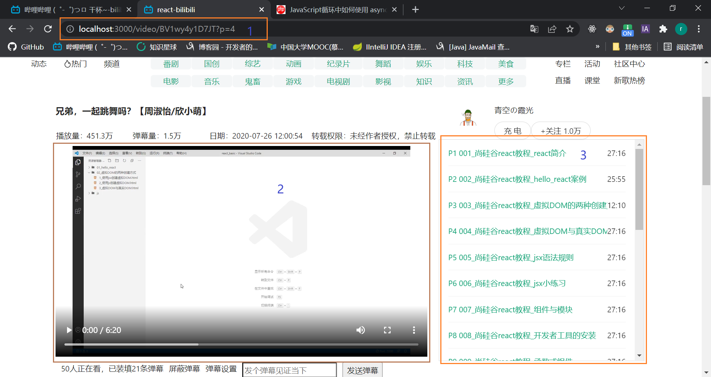

### 2022.3.3
- antd栅格系统的不熟悉，出现了现在未解决的问题
### 2020.3.10
- 关于循环中如何使用 async/await：https://www.php.cn/js-tutorial-465033.html
### 2020.3.12
- 关于video详情页的设计问题

  最初，没有考虑Video组件刚挂载的问题，只是在2、3处进行处理（最初只考虑了2只能被3影响，实际Video组件挂载的时候也能影响2）
  - /video对应Video父组件的路由 
  - /video/BV1wy4y1D7JT对应PlayerBlock子组件的路由 
  - 实际上，2被2个地方影响。
    - 首先是Video组件的挂载，同时也会把PlayerBlock子组件给渲染出来，
    这时你并没有点击3，2的this.props.location为undefined，那怎么根据已挂载的Video路由组件渲染合适的PlayerBlock组件呢？
    没错，通过父子组件的传递参数来解决，Video可以通过this.props.location.search来获得url的参数，然后给PlayerBlock子组件直接传参，
    PlayerBlock组件接收到后，获取url的视频数据进行渲染。
    - 然后，3也可以影响2，这个时候，就通过路由组件的传参来解决了。2获得3传来的参数，重新渲染2
    ```react
    // VideoList组件（3）
    <Link to={`/video/BV1wy4y1D7JT?p=${item.id}`}>
    // Video路由组件（2）
    <Switch>
        <Route path={`/video/BV1wy4y1D7JT`} component={PlayerBlock}/>
    </Switch>
    ```
  - 总结：2处的渲染受到2个地方影响（1、3），1的话，是因为父组件渲染子组件时需要；3的话，是Video组件挂载完之后，3处通过给2路由组件传参来影响